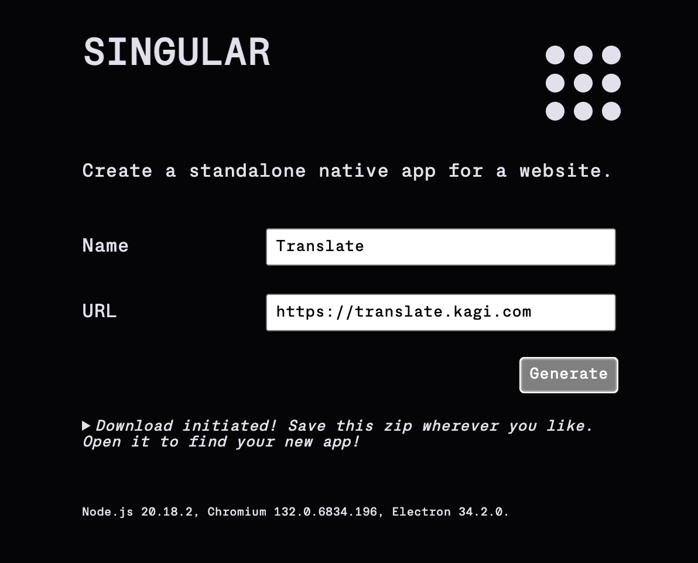

# Singular

Singular is software for opening a web URL in a standalone process.

It has two modes:
- Install a web app as a "native" app on your OS
- Open a URL in a temporary app which disappears forever on close

WARNING: This is not production software yet, just scratching an itch and exploring
alternative ways to use the web which go beyond what contemporary browsers do.

## Ephemeral web apps

Browsers are cognitively and emotionally heavy in so many ways - tabs, windows, product branding, company branding, "browser wars", extensions, history and link coloring, ads, surveillance and tracking, desktop vs mobile, sync, accounts, cookies, sessions...

What if we let a URL stand alone to be itself, without the weight of an "environment" of a containing browser?

It doesn't remove all of the load of "browser", but this is an experiment in finding out how much, and what other trade-offs are made.

But why do this in the first place? There are myriad reasons why I want to open a URL that is in an isolated process at the OS level, disconnected from my browser profile and not part of my tabs/windows world - feels like a 1000 cuts per day:

- Watching a one-off video without poisoning The Algorithm
- Listening to some music without thinking about where it's coming from in a sea of tabs
- Temporarily watching a page for changes in a way that I can get back to it easily
- Working with some data or text where I need to switch back and forth rapidly between it and other web pages

Usage:

- Open the app
- Enter a URL
- Click `Open as temporary app`

## Installed web apps

There are loads of websites I love to open as a standalone and persistent process so that they get some of the benefits of first-class treatment by the operating system.

I used Nativeifer for this for years, but they stopped developing it because browsers were supporting PWAs on desktop in a few ways. However, desktop PWAs are not nearly sufficient as replacement (and are their own tire fire). I looked at the Nativefier code, and it's... massive and ancient.

Also, relying on PWAs doesn't let me install the URLs *I* need - it leaves that choice to the browser and the publisher.

This is a stab at the most minimal approach I could manage. No niceties yet, eg favicons.

Usage:

- Open the app
- Enter an app name of your choice
- Enter a URL
- Click `Generate installable app`

An app is generated and zipped up, and you are prompted to download the zip file.

In the zip file is the generated app. Install it as you would any app for your OS.

## Current status

- DANGEROUS, no audits and missing all of the security UX of a full browser
- Only tested on macOS

## TODO

Priority features
- favicons -> app icons

Build/deploy
- local build
- remote build
- auto release

Runtime
- auto-update generated apps (eg electron version)
- or tauri + webview, eg Pake?

Horizontality
- registry
- un/install
- cross-app comms layer

Extensibility
- web-extensions...

## Thanks

- [Electron-packager](https://electron.github.io/packager/main/index.html) for the heavy lifting
- [Cross-zip (@feross)](https://github.com/feross/cross-zip) resolves symlinks tysm
- Font: https://servermono.com/
- Colors: https://realtimecolors.com
- Spinner: https://loading.io/css/
