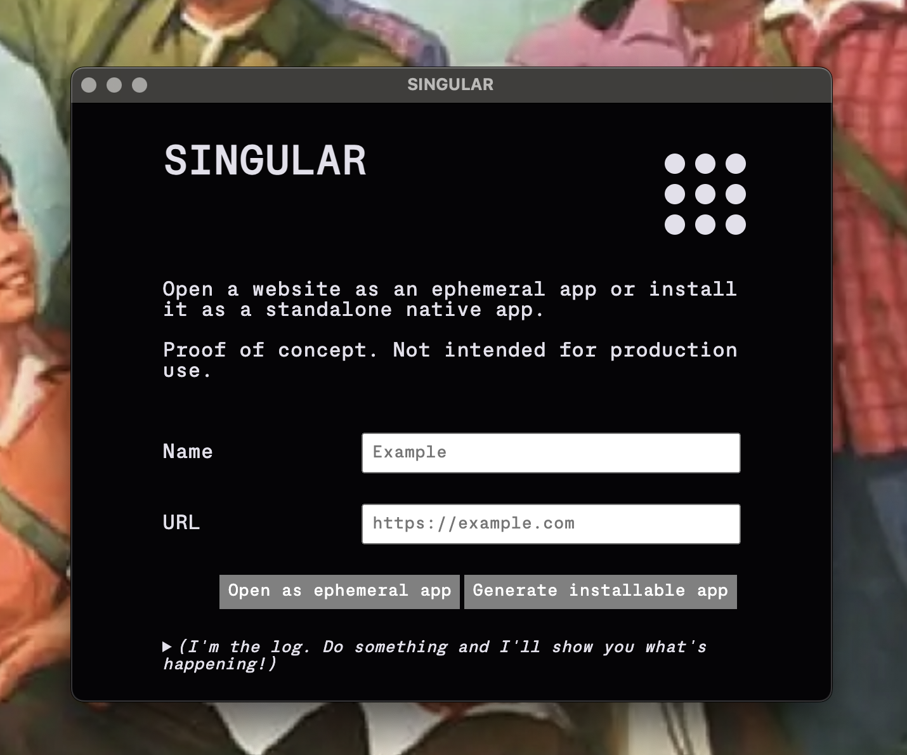

# Singular

Install web apps as native apps, or just open a URL in a "temporary" app that
closes and disappears forever on close.

WARNING: This is not production software yet, just scratching an itch and exploring
alternative ways to use the web.

## Why

I missed Nativeifer.

Desktop PWAs are not nearly sufficient as replacement (and are their own tire fire).
I looked at the Nativefier code, and it's... massive and ancient.

This is a stab at the most minimal approach I could manage. No niceties.

Current status:

- Only tested on macOS

## Install an app

- Open the app
- Enter an app name (your choice)
- Enter a URL
- Click `Generate`

An app is generated and zipped up, and you are prompted to download the zip file.

In the zip file is the generated app. Install it in whatever way your OS requires, or you prefer.

## Open a URL with an ephemeral browser

## TODO

priority features
- app icons

build/deploy
- local build
- remote build
- auto release

runtime
- auto-update generated apps (eg electron version)
- or tauri + webview, eg Pake?

horizontality
- registry
- un/install
- cross-app comms layer

extensibility
- web-extensions...

## Thanks

- [Electron-packager](https://electron.github.io/packager/main/index.html) for the heavy lifting
- [Cross-zip (@feross)](https://github.com/feross/cross-zip) resolves symlinks tysm
- Font: https://servermono.com/
- Colors: https://realtimecolors.com
- Spinner: https://loading.io/css/
